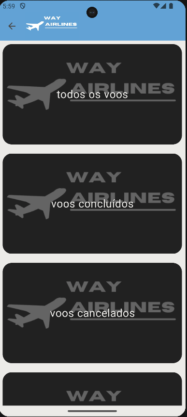
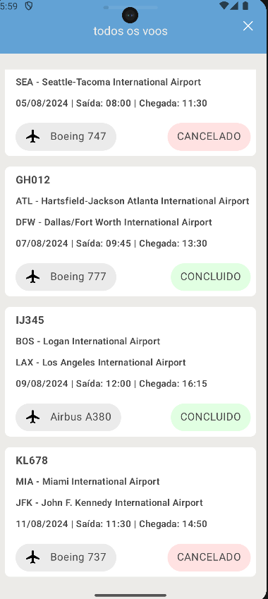
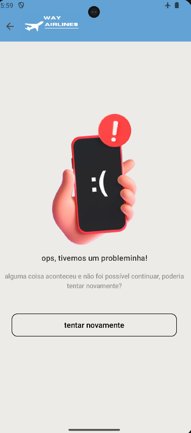

# Way Airlines App Challenge - Setup Guide - by Lucas Esteves
## Way Airlines App Challenge | Android | Kotlin

Welcome to Way Airlines App Challenge project! This guide will walk you through setting up the environment to test the project on your local machine.

`Jetpack Compose` & `MVI Architecture`

## 📷 Previews

<p align="center">


</br>
</p>

## 🛠 Tech Stack & Open Source Libraries
- Minimum SDK level 24.
- 100% [Jetpack Compose](https://developer.android.com/jetpack/compose) based + [Coroutines](https://github.com/Kotlin/kotlinx.coroutines) + [Flow](https://kotlin.github.io/kotlinx.coroutines/kotlinx-coroutines-core/kotlinx.coroutines.flow/) for asynchronous.
- Jetpack
    - Compose: Android’s modern toolkit for building native UI.
    - ViewModel: UI related data holder and lifecycle aware.
    - App Startup: Provides a straightforward, performant way to initialize components at application startup.
    - Navigation: For navigating screens and [Koin Compose] for injecting dependencies.
    - [Koin]: Dependency Injection.
- [Coil]: Jetpack Compose image loading library.
- [Retrofit2 & OkHttp3](https://github.com/square/retrofit): Construct the REST APIs and paging network data.

## ✍️ Prerequisites

- Android Studio installed on your machine with Java 17.

## Getting Started

1. **Install Java 17:**

    ```
    https://www.oracle.com/java/technologies/javase/jdk17-archive-downloads.html
    ```

2. **Clone the Repository:**

    ```
    git clone https://github.com/lukesteves92/MLChallenge.git
    ```

3. **Open Project in Android Studio:**

   Open Android Studio and navigate to `File` > `Open` and select the cloned project directory.

4. **Set Java 17 by Default:**

   Open Android Studio and navigate to `File` > `Settings` > `Build, Execution...` > `Build Tools` > `Gradle` and select the new `Gradle SDK` downloaded, Java 17.

## 🔄 Additional Setup Steps

5. **Set up a Mock API using Beeceptor (or any other Mock API service):**

    - Go to [Beeceptor](https://beeceptor.com/) and create a new mock API.
    - Name your API and copy the base URL that is generated.

6. **Add the Base URL to the Gradle Build Config:**

    - Open the `build.gradle` file for your project.
    - Inside the `android` block, find the `buildTypes` section and add the following line inside the relevant `buildType` (e.g., `debug` or `release`):

      ```gradle
      buildConfigField(type = "String", name = "URL_BASE", value = "\"{Your URL}\"")
      ```
    - Replace `{Your URL}` with the URL from Beeceptor (or your mock API service).

7. **Configure the "/flights" Endpoint on Your Mock API:**

    - Go back to your mock API service (e.g., Beeceptor) and create an endpoint for `/flights`.
    - Add the following response body for the `/flights` endpoint:

   ```json
   {
     "flights": [
       {
         "flight_id": "AB123",
         "status": "CONCLUIDO",
         "completion_status": "ATRASOU",
         "start_date": "2024-08-01",
         "end_date": "2024-08-01",
         "departure_time": "10:00",
         "arrival_time": "14:00",
         "departure_airport": "JFK - John F. Kennedy International Airport",
         "arrival_airport": "LAX - Los Angeles International Airport",
         "airplane_name": "Boeing 737"
       },
       {
         "flight_id": "CD456",
         "status": "CONCLUIDO",
         "completion_status": "NO_HORARIO",
         "start_date": "2024-08-03",
         "end_date": "2024-08-03",
         "departure_time": "15:30",
         "arrival_time": "19:45",
         "departure_airport": "ORD - O'Hare International Airport",
         "arrival_airport": "MIA - Miami International Airport",
         "airplane_name": "Airbus A320"
       },
       {
         "flight_id": "EF789",
         "status": "CANCELADO",
         "completion_status": "CANCELADO",
         "start_date": "2024-08-05",
         "end_date": "2024-08-05",
         "departure_time": "08:00",
         "arrival_time": "11:30",
         "departure_airport": "SFO - San Francisco International Airport",
         "arrival_airport": "SEA - Seattle-Tacoma International Airport",
         "airplane_name": "Boeing 747"
       },
       {
         "flight_id": "GH012",
         "status": "CONCLUIDO",
         "completion_status": "ATRASOU",
         "start_date": "2024-08-07",
         "end_date": "2024-08-07",
         "departure_time": "09:45",
         "arrival_time": "13:30",
         "departure_airport": "ATL - Hartsfield-Jackson Atlanta International Airport",
         "arrival_airport": "DFW - Dallas/Fort Worth International Airport",
         "airplane_name": "Boeing 777"
       },
       {
         "flight_id": "IJ345",
         "status": "CONCLUIDO",
         "completion_status": "NO_HORARIO",
         "start_date": "2024-08-09",
         "end_date": "2024-08-09",
         "departure_time": "12:00",
         "arrival_time": "16:15",
         "departure_airport": "BOS - Logan International Airport",
         "arrival_airport": "LAX - Los Angeles International Airport",
         "airplane_name": "Airbus A380"
       },
       {
         "flight_id": "KL678",
         "status": "CANCELADO",
         "completion_status": "CANCELADO",
         "start_date": "2024-08-11",
         "end_date": "2024-08-11",
         "departure_time": "11:30",
         "arrival_time": "14:50",
         "departure_airport": "MIA - Miami International Airport",
         "arrival_airport": "JFK - John F. Kennedy International Airport",
         "airplane_name": "Boeing 737"
       },
       {
         "flight_id": "MN901",
         "status": "CONCLUIDO",
         "completion_status": "ATRASOU",
         "start_date": "2024-08-13",
         "end_date": "2024-08-13",
         "departure_time": "06:00",
         "arrival_time": "09:30",
         "departure_airport": "LAX - Los Angeles International Airport",
         "arrival_airport": "SFO - San Francisco International Airport",
         "airplane_name": "Airbus A320"
       },
       {
         "flight_id": "OP234",
         "status": "CONCLUIDO",
         "completion_status": "NO_HORARIO",
         "start_date": "2024-08-15",
         "end_date": "2024-08-15",
         "departure_time": "14:00",
         "arrival_time": "18:30",
         "departure_airport": "SEA - Seattle-Tacoma International Airport",
         "arrival_airport": "ORD - O'Hare International Airport",
         "airplane_name": "Boeing 777"
       },
       {
         "flight_id": "QR567",
         "status": "CANCELADO",
         "completion_status": "CANCELADO",
         "start_date": "2024-08-17",
         "end_date": "2024-08-17",
         "departure_time": "10:30",
         "arrival_time": "13:45",
         "departure_airport": "DFW - Dallas/Fort Worth International Airport",
         "arrival_airport": "ATL - Hartsfield-Jackson Atlanta International Airport",
         "airplane_name": "Boeing 747"
       },
       {
         "flight_id": "ST890",
         "status": "CONCLUIDO",
         "completion_status": "ATRASOU",
         "start_date": "2024-08-19",
         "end_date": "2024-08-19",
         "departure_time": "17:00",
         "arrival_time": "20:45",
         "departure_airport": "LGA - LaGuardia Airport",
         "arrival_airport": "MIA - Miami International Airport",
         "airplane_name": "Airbus A380"
       },
       {
         "flight_id": "UV123",
         "status": "CONCLUIDO",
         "completion_status": "NO_HORARIO",
         "start_date": "2024-08-21",
         "end_date": "2024-08-21",
         "departure_time": "08:30",
         "arrival_time": "12:15",
         "departure_airport": "ORD - O'Hare International Airport",
         "arrival_airport": "DFW - Dallas/Fort Worth International Airport",
         "airplane_name": "Boeing 737"
       },
       {
         "flight_id": "WX456",
         "status": "CANCELADO",
         "completion_status": "CANCELADO",
         "start_date": "2024-08-23",
         "end_date": "2024-08-23",
         "departure_time": "16:00",
         "arrival_time": "19:30",
         "departure_airport": "SFO - San Francisco International Airport",
         "arrival_airport": "JFK - John F. Kennedy International Airport",
         "airplane_name": "Airbus A320"
       },
       {
         "flight_id": "YZ789",
         "status": "CONCLUIDO",
         "completion_status": "ATRASOU",
         "start_date": "2024-08-25",
         "end_date": "2024-08-25",
         "departure_time": "11:00",
         "arrival_time": "14:45",
         "departure_airport": "ATL - Hartsfield-Jackson Atlanta International Airport",
         "arrival_airport": "LAX - Los Angeles International Airport",
         "airplane_name": "Boeing 777"
       },
       {
         "flight_id": "AB987",
         "status": "CONCLUIDO",
         "completion_status": "NO_HORARIO",
         "start_date": "2024-08-27",
         "end_date": "2024-08-27",
         "departure_time": "09:00",
         "arrival_time": "12:30",
         "departure_airport": "SEA - Seattle-Tacoma International Airport",
         "arrival_airport": "ORD - O'Hare International Airport",
         "airplane_name": "Boeing 747"
       },
       {
         "flight_id": "CD654",
         "status": "CANCELADO",
         "completion_status": "CANCELADO",
         "start_date": "2024-08-29",
         "end_date": "2024-08-29",
         "departure_time": "13:00",
         "arrival_time": "16:45",
         "departure_airport": "JFK - John F. Kennedy International Airport",
         "arrival_airport": "MIA - Miami International Airport",
         "airplane_name": "Airbus A320"
       },
       {
         "flight_id": "EF321",
         "status": "CONCLUIDO",
         "completion_status": "ATRASOU",
         "start_date": "2024-08-31",
         "end_date": "2024-08-31",
         "departure_time": "07:30",
         "arrival_time": "10:45",
         "departure_airport": "LAX - Los Angeles International Airport",
         "arrival_airport": "DFW - Dallas/Fort Worth International Airport",
         "airplane_name": "Boeing 737"
       },
       {
         "flight_id": "GH098",
         "status": "CONCLUIDO",
         "completion_status": "NO_HORARIO",
         "start_date": "2024-09-02",
         "end_date": "2024-09-02",
         "departure_time": "12:15",
         "arrival_time": "15:45",
         "departure_airport": "ORD - O'Hare International Airport",
         "arrival_airport": "SEA - Seattle-Tacoma International Airport",
         "airplane_name": "Airbus A380"
       },
       {
         "flight_id": "IJ765",
         "status": "CANCELADO",
         "completion_status": "CANCELADO",
         "start_date": "2024-09-04",
         "end_date": "2024-09-04",
         "departure_time": "18:00",
         "arrival_time": "21:45",
         "departure_airport": "MIA - Miami International Airport",
         "arrival_airport": "LAX - Los Angeles International Airport",
         "airplane_name": "Boeing 747"
       },
       {
         "flight_id": "KL432",
         "status": "CONCLUIDO",
         "completion_status": "ATRASOU",
         "start_date": "2024-09-06",
         "end_date": "2024-09-06",
         "departure_time": "13:30",
         "arrival_time": "17:15",
         "departure_airport": "JFK - John F. Kennedy International Airport",
         "arrival_airport": "ORD - O'Hare International Airport",
         "airplane_name": "Boeing 737"
       },
       {
         "flight_id": "MN109",
         "status": "CONCLUIDO",
         "completion_status": "NO_HORARIO",
         "start_date": "2024-09-08",
         "end_date": "2024-09-08",
         "departure_time": "05:45",
         "arrival_time": "09:00",
         "departure_airport": "LAX - Los Angeles International Airport",
         "arrival_airport": "ATL - Hartsfield-Jackson Atlanta International Airport",
         "airplane_name": "Airbus A320"
       }
     ]
   }

8. **Run the App:**

    - Build and run the Way Airlines App Challenge in Android Studio.

Congratulations! You have successfully set up the environment to test the Way Airlines App Challenge project on your local machine. If you encounter any issues, feel free to reach out for assistance. Enjoy!

